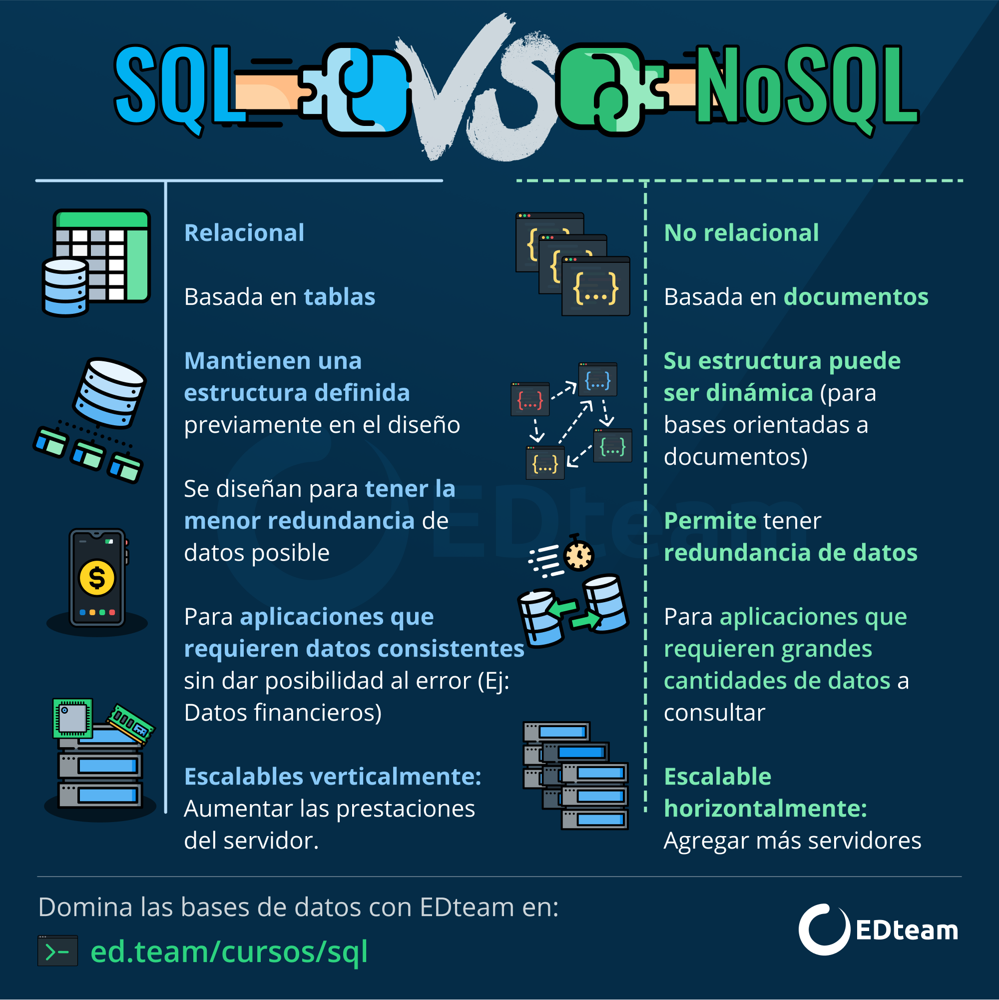

```{r,echo=FALSE, out.width="50%",fig.align="center"}
knitr::include_graphics("logoPUCP.png") 
```

# **1. Tipos de bases de datos**

Una base de datos es una recopilación organizada de información o datos estructurados, que normalmente se almacena de forma electrónica en un sistema informático. Normalmente, una base de datos está controlada por un sistema de gestión de bases de datos (DBMS). En conjunto, los datos y el DBMS, junto con las aplicaciones asociadas a ellos, reciben el nombre de sistema de bases de datos, abreviado normalmente a simplemente base de datos.

Los datos de los tipos más comunes de bases de datos en funcionamiento actualmente se suelen utilizar como estructuras de filas y columnas en una serie de tablas para aumentar la eficacia del procesamiento y la consulta de datos. Así, se puede acceder, gestionar, modificar, actualizar, controlar y organizar fácilmente los datos. La mayoría de las bases de datos utilizan un lenguaje de consulta estructurada (SQL) para escribir y consultar datos.


```{r,echo=FALSE, out.width="70%",fig.align="center"}
 
```

Si hablamos de bases de datos estructurados solemos referirnos a aquellos que tienen un formato definido, por ejemplo una tabla con filas y columnas; a diferencia de los datos no estructurados que no tienen un patrón predeterminado (como pueden ser imágenes, videos, sonidos y texto libre) (Reneboldi, 2020).


# **2. Data frames**

R es un lenguaje orientado a objetos. Los objetos pueden ser usados para guardar valores y pueden modificarse (mediante funciones) como por ejemplo sumar dos objetos o calcular la media. R tiene cinco tipos básicos de objetos:

- character
- numeric (número real)
- integer
- complex
- logical (True/False)

El objeto más básico en R es un vector, que sólo puede contener objetos de la misma clase.

Los **data frame** se usan para almacenar datos en forma de tablas (filas / columnas), como estamos habituados en Excel, Spss, etc. Pueden almacenar objetos/datos de distinto tipo. Normalmente los data frame los creamos al cargar/leer una base de datos relacional, sin embargo podemos crear un data frame desde R para ver su estructura.

```{r}
presupuesto2021 = data.frame( prioridad= c("reactivación", "educación", "salud", "mujer","pobreza"),
                              monto_millones = c(9879, 33132, 20991, 690, 5392))
```

Examinemos algunas características básicas del data frame:

```{r}
class(presupuesto2021) #clase del objeto
nrow(presupuesto2021) #número de filas (casos)
ncol(presupuesto2021) #número de columnas (variables)
dim(presupuesto2021) #número de filas (casos) y columnas (variables) 
str (presupuesto2021) #estructura 
names(presupuesto2021) #nombre de las variables 
head(presupuesto2021) #nos muestra las primeras 6 observaciones de la data
tail(presupuesto2021) #nos muestra las 6 últimas observaciones de la data
```

Para acceder a los elementos de un data frame utilizamos los símbolos $ o [].
Si queremos seleccionar la variable "monto_millones" de nuestro data frame:

```{r}
presupuesto2021$monto_millones #opción 1
presupuesto2021[2] #opción 2
```


# **3. Cargar bases de datos de diversas extensiones en R**

R nos permite importar y exportar bases de datos en diversas extensiones.

```{r,echo=FALSE, out.width="70%",fig.align="center"}
knitr::include_graphics("datos.png") 
```

Algunas que usaremos en este curso son las siguientes:

| Extensión | Tipo de archivo              |
|-----------|------------------------------|
| rda o RData      | Archivo en formato R         |
| csv       | Archivo delimitado por comas |
| xls       | Archivo en formato Excel     |
| sav       | Archivo en formato SPSS      |
| dta       | Archivo en formato STATA     |
| JSON       | JavaScript Object Notation     |
| XML       | Extensible Markup Language     |

Los datos pueden estar en algun lugar de la web; si crees que esos datos permanecerán en ese sitio, quizás puedas sólo utilizar su link de descarga y leerlos directamente. Lo más seguro, en todo caso, es usarlos de esa manera y luego guardar esa data en tu **repositorio** del proyecto (en la ‘nube’). Esto facilitará su lectura y **replicabilidad**.

NOTA: En el github no leemos el URL sino el **raw**

Si por alguna razón deseas leerlos desde tu computadora, debes tener los archivos en la misma carpeta de tu R Markdown, R Notebook.

Para cargar archivos de distintos formatos debemos cargar el paquete "rio". La libreria "rio" es muy versatil y permite importar datos en distintos formatos con el comendo **import()**

Instalamos el paquete (por si no lo tienen), utilizando el siguiente comando:**install.packages("rio")**

+ **Leyendo STATA**

La encuesta LAPOP está en la web. Varios años son de libre acceso, pero podemos guardar una copia en GitHub, y leer esa copia desde ahí:

```{r}
library(rio)

#Opción 1
lkDTA="https://github.com/PoliticayGobiernoPUCP/estadistica_anapol2/raw/master/DATA/lapop2012.dta"
dataStata=import(lkDTA)

#Opción 2 
dataStata=import("https://github.com/PoliticayGobiernoPUCP/estadistica_anapol2/raw/master/DATA/lapop2012.dta")
```

Toda data debe tener una guía metodológica o una descripción de las columnas (metadata) en su web original. Es bueno copiar y mantener una copia de esos materiales en tu proyecto.

+ **Leyendo SPSS**

Abramos el mismo archivo de LAPOP, pero en SPSS:

```{r}
lkSAV="https://github.com/PoliticayGobiernoPUCP/estadistica_anapol2/raw/master/DATA/lapop2012.sav"
dataSpss=import(lkSAV)
```

+ **Leyendo Excel**

El mismo archivo, pero en EXCEL:

```{r}
lkXLSX="https://github.com/PoliticayGobiernoPUCP/estadistica_anapol2/raw/master/DATA/lapop2012.xlsx"
dataExcel=import(lkXLSX)
```

+ **Leyendo CSV**

Recuerden que un archivo csv es delimitado por comas, sin embargo, siempre verifiquen cual es el separador de su ordenador. Si la data está en CSV, podemos usar rio, y también la función del R básico:

```{r}
lkCSV="https://github.com/PoliticayGobiernoPUCP/estadistica_anapol2/raw/master/DATA/lapop2012.csv"
dataCSV=import(lkCSV)
```

Otra forma:

```{r}
lapop=read.csv("https://github.com/PoliticayGobiernoPUCP/estadistica_anapol2/raw/master/DATA/lapop2012.csv",                 # Nombre del archivo o ruta completa del archivo
         header = TRUE,        # Leer el encabezado (TRUE) o no (FALSE)
         sep = ",",            # Separador de los valores
         dec = ".",            # Punto decimal
         fill = TRUE)          # Rellenar celdas vacías (TRUE) o no (FALSE)
```

+   **Archivos de GoogleDoc**

Podemos muchas veces usar los formularios de Google Docs para recoger información. Estos formularios dejan la información en una hoja de calculo de google (GoogleSheet). Si Ud publica esa data como archivo tipo CSV, use el comando **read.csv**.

Ejemplo:

```{r}
lkDOC=("https://docs.google.com/spreadsheets/d/e/2PACX-1vTc50BnnorXCAeG2BvFATXQikHPnQPhg6zxPfE8MLEBKWsUL3Vl3Skr53bZWbr9rA/pub?output=csv")
dataDOC=read.csv(lkDOC)
```


+   **Archivos de Datos Espaciales**

R también nos permite hacer análisis de datos geoespaciales. Esto es relevante, ya que mas del 70 de la información que utilizamos en cualquier tipo de
disciplina es, o puede ser, georreferenciada. Se trata de información a la cual puede asignarse una posición geográfica

Los datos que pertenecen a una base de datos geográfica se componen de tres elementos la geometría, topología y atributos, por lo que se encuentran distribuidos en diversos archivos. 

En este marco, el Formato SHAPEFILE es un conjunto de archivos que nos permiten almacenar la forma, ubicación y atributos de nuestros vectores shp. Son tres o más, con extensiones de archivo concretas que se deben almacenar en el mismo espacio de trabajo de proyecto.

Una de las formas de leer este tivo de datos es a través de ggplot. Vamos a leer el mapa de los departamentos del Perú, que hemos obtenido a través del portal GEO GPS PERÚ:https://www.geogpsperu.com/

Este mapa contiene 7 archivos en diversas extensiones. Para abrir el mapa utilizaremos la extensión shp., sin embargo todos los demás archivos deben estar en la carpeta sino no podrá ser posible la lectura.Instalamos ggplot2 y sf

```{r}
library(ggplot2)
library(sf) 
mapDEP=sf::read_sf("DEPARTAMENTOS_inei_geogpsperu_suyopomalia.shp")
mapa1 = ggplot(mapDEP) + geom_sf()
mapa1
```


# **4. Lugares ricos en datos (Bases estructuradas)**

### INEI

Catálogo de base de datos INEI: https://www.inei.gob.pe/media/difusion/apps/ 

BASES DE DATOS
https://www.inei.gob.pe/bases-de-datos/

ENCUESTAS-SISTEMAS DE CONSULTAS
https://www.inei.gob.pe/sistemas-consulta/

ENDES
https://www.inei.gob.pe/media/MenuRecursivo/publicaciones_digitales/Est/Endes2019/

CENSO
http://censo2017.inei.gob.pe/

ENAPRES
http://proyecto.inei.gob.pe/enapres/#


### MIDIS

INFOMIDIS-MIDIS
http://sdv.midis.gob.pe/infomidis/#/

REDINFORMA-MIDIS
http://sdv.midis.gob.pe/redinforma/

MI DISTRITO
http://sdv.midis.gob.pe/RedInforma/Reporte/Reporte?id=18

MI REGIÓN
http://sdv.midis.gob.pe/RedInforma/Reporte/Reporte?id=17

TABLERO DE CONTROL DE LA ANEMIA
http://sdv.midis.gob.pe/RedInforma/Reporte/OtrosRecursos?id=1

MI ÁMBITO
http://sdv.midis.gob.pe/RedInforma/Reporte/Reporte?id=27

FED
http://www.midis.gob.pe/fed/sobre-el-fed/el-fed

EVIDENCIA MIDIS
http://evidencia.midis.gob.pe/

INFOJUNTOS
http://www2.juntos.gob.pe/infojuntos/

INFO PENSIÓN
https://www.pension65.gob.pe/nuestros-usuarios/infopension/
https://www.pension65.gob.pe/publicaciones/informes-y-estudios/

### Ministerio de Economía y Finanzas

MEF-EVALUACIONES
EVALUACIONES DE IMPACTO
https://www.mef.gob.pe/es/?option=com_content&language=es-ES&Itemid=100751&view=article&catid=624&id=5357&lang=es-ES

Evaluaciones de Diseño y Ejecución Presupuestal (EDEP)
https://www.mef.gob.pe/es/?option=com_content&language=es-ES&Itemid=100751&view=article&catid=211&id=5356&lang=es-ES

MEF: datos abiertos
http://www.mef.gob.pe/datos_abiertos/index.html

### MINISTERIO DE VIVIENDA-MVCS

DATASS
https://datass.vivienda.gob.pe/

### MINSA

REUNIS
https://www.minsa.gob.pe/reunis/
https://www.minsa.gob.pe/reunis/data/Anemia_Infantil.asp
https://www.datosabiertos.gob.pe/group/datos-abiertos-de-covid-19

### MIMP

ESTADÍSTICAS
https://www.mimp.gob.pe/omep/estadisticas-violencia.php

SEGUIMIENTO
https://www.mimp.gob.pe/omep/marco-conceptual-seguimiento.php

EVALUACIÓN
https://www.mimp.gob.pe/omep/marco-conceptual-evaluacion.php

### Banco Mundial: estadísticas
http://data.worldbank.org/
https://govdata360.worldbank.org

### CEPAL: publicaciones y estadísticas
http://estadisticas.cepal.org/cepalstat/WEB_CEPALSTAT/Portada.asp

### Educación

ESCALE (Estadística de la Calidad Educativa)
http://escale.minedu.gob.pe/


### ONPE

RESULTADOS - ELECCIONES PRESIDENCIALES 2021 (1V)
https://www.datosabiertos.gob.pe/dataset/resultados-por-mesa-de-las-elecciones-presidenciales-2021-primera-vuelta-oficina-nacional-de

RESULTADOS - ELECCIONES PRESIDENCIALES 2021 (2V)
https://www.datosabiertos.gob.pe/dataset/resultados-por-mesa-de-las-elecciones-presidenciales-2021-segunda-vuelta-oficina-nacional-de

RESULTADOS - ELECCIONES CONGRESALES 2021
https://www.datosabiertos.gob.pe/dataset/resultados-por-mesa-de-las-elecciones-congresales-2021-oficina-nacional-de-procesos


### FMI: data
http://www.imf.org/data

### Objetivos de Desarrollo del Milenio: estadísticas
http://mdgs.un.org/unsd/mdg/Data.aspx

### OIT: estadísticas y bases de datos
http://www.ilo.org/global/statistics-and-databases/lang–es/inde x.htm

### PNUD: Índice de Desarrollo Humano
http://hdr.undp.org/es

### SIEA: estadísticas
http://siea.minagri.gob.pe/siea/

### SITEAL: estadísticas
http://www.siteal.iipe-oei.org/

### UNESCO: estadísticas
http://es.unesco.org/gem-report/

### UNICEF: estadísticas
http://www.unicef.org/spanish/statistics/

### Barómetro de las Américas (LAPOP)
http://datasets.americasbarometer.org/database/login.php

### World Value Survey
https://www.worldvaluessurvey.org/WVSContents.jsp

### Latinobarómetro
https://www.latinobarometro.org/latContents.jsp?CMSID=Datos&CMSID=Datos

### Varieties of Democracy (V-Dem)
https://www.v-dem.net/vdemds.html

### Corruption Perception Index
https://www.transparency.org/en/cpi/2020

### Our World in Data
https://ourworldindata.org

### Fragile States Index
https://fragilestatesindex.org

### State Capacity Dataset
http://www-personal.umich.edu/~jkhanson/state_capacity.html


