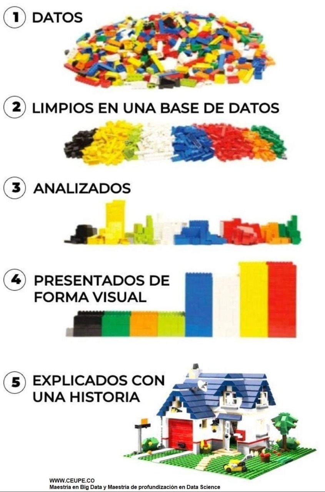

```{r,echo=FALSE, out.width="40%",fig.align="center"}
knitr::include_graphics("logoPUCP.png") 
```

# **1. Introducción al laboratorio**

### **Objetivo**

El objetivo principal del laboratorio es desarrollar habilidades de pre procesamiento de datos, es decir se dotará al estudiante de herramientas para la lectura, limpieza, formateo e integración de datos, utilizando el programa R y su entorno R Studio.

```{r,echo=FALSE, out.width="40%",fig.align="center"}
 
```

### **Jefes de práctica**

+ Alexander Benites, Politólogo

+ Wendy Adrianzén, Politóloga


### **Dinámica de las sesiones**

Las sesiones se realizarán durante 2 horas, teniendo a la mitad del curso un receso de 10 minutos. El material de la sesión estará disponible todos los viernes, previo a cada clase. Se requiere puntualidad del alumno/a, así como respeto y responsabilidad en las actividades.

La Facultad entregará un certificado de manejo del “Lenguaje R para Análisis Estadístico” a nivel INTERMEDIO al haber obtenido una nota mayor o igual a 14 en cada una de las prácticas calificada

### **Distribución de las sesiones**

Ver el excel adjunto

# **2. Requisitos**

### **2.1. Instalación del programa**

Luego de haber llevado el curso de Estadística, todos deben tener instalado el programa, pero por si las dudas, les dejamos nuevamente los instaladores.

+ **Primero debe instalar R**. Podrán encontrar los instaladores para distintos sistemas operativos en la siguiente dirección: https://cran.r-project.org/

+ **Luego R Studio**. Una vez instalado el programa, podemos instalar su entorno de desarrollo integrado: R studio. Podrán encontrar los instaladores para distintos sistemas operativos en la siguiente dirección: https://rstudio.com/products/rstudio/download/#download

### **2.2. Configuración de directorio de trabajo**

Recuerden que antes de comenzar a hacer operaciones con R necesitamos definir nuestro lugar de trabajo. Para esto tenemos dos alternativas.

#### **Opción 1. Fijar directorio**

Para ver nuestro lugar de trabajo actual escribimos el siguiente comando:

```{r}
getwd()
```


Para una mejor experiencia, pueden crear una carpeta en la cual trabajá a lo largo del curso. La ruta a través del menú es: **Session > Set Working Directory > Choose Directory**. Esto abrirá una ventana emergente, donde buscaremos la carpeta en la cual vamos a trabajar, la seleccionamos y apretamos "Open".

Si queremos verificar el cambio, volvemos a digitar la función **"getwd()"** en la consola.

#### **Opción 2. Proyecto de R**

Otra opción en crear un proyecto. Al crearlo todos los ficheros quedan vinculados directamente al proyecto. Para crear un proyecto seleccione la ruta: **File > New project...** Se abrirá la siguiente ventana:

```{r,echo=FALSE, out.width="40%",fig.align="center"}
knitr::include_graphics("proyecto.png") 
```


Para crear un proyecto en un nuevo directorio, hacemos clic en el botón New Directory. Seguidamente, seleccionamos el tipo de proyecto, en nuestro caso Empty Project. Ahora, asignamos un nombre al directorio (carpeta) que se va a crear y que al mismo tiempo será el nombre del proyecto de R. Para terminar, hacemos clic en el botón Create Project. Al seguir este proceso se habrá creado una carpeta en Documentos y un fichero nombre_carpeta.Rproj.

Para crear un proyecto en una carpeta que ya existe, hacemos clic en el botón Existing Directory y después seleccionamos la carpeta ayudándonos del Browse.. si fuera necesario. Una vez elegida la carpeta, clicamos en Create Project.

Para abrir un proyecto hacemos doble clic sobre el archivo con extensión .Rproj o lo abrimos desde el menú de RStudio: File > Open Project...

Ventaja de los proyectos: cualquier fichero que creemos (script de R, documento de Rmarkdown, etc.) y guardemos se guardará en la carpeta del proyecto.


### **2.3. Github**

Vamos a requerir que se creen una cuenta en GitHub. GitHub permite alojar proyectos utilizando el sistema de control de versiones Git. Se utiliza principalmente para la creación de código fuente de programas de ordenador. Para fines de este curso, vamos a utilizar Github como repositorio para cargar nuestras bases de datos, administrar nuestros archivos etc.

**Créese una cuenta en Github:**

Ingrese a esta dirección: https://github.com/

Si quiere saber más de GitHub visite:

https://www.youtube.com/watch?v=Uw8SIaAK-vw&t=134s

**Github como repositorio**

+ En la parte superior derecha seleccione "+", seleccione "New repository" y siga los pasos precisando el nombre del respositorio, descripción (opcional),elija la visibilidad del repositorio (publico o privado), y ¡cree su repositorio!

+ Cargue archivos seleccionando Add file > Upload files > Choose your files > Commit changes

Si quiere profundizar más sobre el GitHub como repositorio:

https://www.youtube.com/watch?v=JN6rzv4zSJ4s

### **2.4. R Markdown y Knit en R Studio**

Vamos a trabajar en archivos R markdown (Rmd), pero para presentarlos de una manera amigable, podemos exportarlos en formato PDF, Html o en una página web.

Para una mejor experiencia, antes de exportar a PDF, deberá instalar "tinytex", con cualquiera de los siguientes códigos desde su consola:

**install.packages('tinytex')**

**tinytex::install_tinytex()**


## **3. Comunidad R**

En muchas ocasiones necesitamos ayuda sobre cómo funciona una determinada función, cuáles son sus argumentos, etc.

```{r}
help(mean)
?mean
mean    # y pulsamos la tecla F1
```

Tambien pueden consultar algunas webs que ofrecen ayuda:

+ R Bloggers: <https://www.r-bloggers.com/>
+ Stack Overflow: <https://stackoverflow.com/>

La comunidad de R también está en las redes sociales y es muy activa. 
Pueden usar twitter, instagram y facebook para enterarse de actualizaciones, códigos, etc. Algunas cuentas de twitter interesantes por aquí:

@aRtsy_package: <https://twitter.com/aRtsy_package>
@rfortherest: <https://twitter.com/rfortherest>
@RLangPackage: <https://twitter.com/RLangPackage>
@rstatstweet: <https://twitter.com/rstatstweet>

# **4. Data frames**

Los data frame se usan para almacenar datos en forma de tablas (filas / columnas), como estamos habituados en Excel, Spss, etc.

Los data frame pueden almacenar objetos/datos de distinto tipo: numéricos, carácter, etc. Normalmente los data frame los creamos al cargar/leer una base de datos, sin embargo podemos crear un data frame desde R para ver su estructura.

```{r}
presupuesto2021 = data.frame( prioridad= c("reactivación", "educación", "salud", "mujer","pobreza"),
                              monto_millones = c(9879, 33132, 20991, 690, 5392))
```

Examinemos algunas características básicas del data frame:

```{r}
class(presupuesto2021) #clase del objeto
nrow(presupuesto2021) #número de filas (casos)
ncol(presupuesto2021) #número de columnas (variables)
dim(presupuesto2021) #número de filas (casos) y columnas (variables) 
str (presupuesto2021) #estructura 
names(presupuesto2021) #nombre de las variables 
head(presupuesto2021) #nos muestra las primeras 6 observaciones de la data
tail(presupuesto2021) #nos muestra las 6 últimas observaciones de la data
```

Para acceder a los elementos de un data frame utilizamos los símbolos $ o [].
Si queremos seleccionar la variable "monto_millones" de nuestro data frame:

```{r}
presupuesto2021$monto_millones #opción 1
presupuesto2021[2] #opción 2
```


# **5. Cargar datos de 'propietary software' en R**

```{r,echo=FALSE, out.width="40%",fig.align="center"}
knitr::include_graphics("datos.png") 
```

R nos permite abrir archivos en diversas extensiones. Algunos que usaremos en este curso son las siguientes:

| Extensión | Tipo de archivo              |
|-----------|------------------------------|
| rda o RData      | Archivo en formato R         |
| csv       | Archivo delimitado por comas |
| xls       | Archivo en formato Excel     |
| sav       | Archivo en formato SPSS      |
| dta       | Archivo en formato STATA     |
| JSON       | JavaScript Object Notation     |
| XML       | Extensible Markup Language     |

Los datos pueden estar en algun lugar de la web; si crees que esos datos permanecerán en ese sitio, quizás puedas sólo utilizar su link de descarga y leerlos directamente. Lo más seguro, en todo caso, es usarlos de esa manera y luego guardar esa data en tu **repositorio** del proyecto (en la ‘nube’). Esto facilitará su lectura y **replicabilidad**.

NOTA: En el git hub no leemos el URL sino el **raw**

Si por alguna razón deseas leerlos desde tu computadora, debes tener los archivos en la misma carpeta de tu R Markdown, R Notebook.

Para cargar archivos de distintos formatos debemos cargar el paquete "rio". La libreria "rio" es muy versatil y permite importar datos en distintos formatos con el comendo **import()**

Instalamos el paquete (por si no lo tienen), utilizando el siguiente comando:**install.packages("rio")**

+ **Leyendo STATA**

La encuesta LAPOP está en la web. Varios años son de libre acceso, pero podemos guardar una copia en GitHub, y leer esa copia desde ahí:

```{r}
library(rio)

#Opción 1
lkDTA="https://github.com/PoliticayGobiernoPUCP/estadistica_anapol2/raw/master/DATA/lapop2012.dta"
dataStata=import(lkDTA)

#Opción 2 
dataStata=import("https://github.com/PoliticayGobiernoPUCP/estadistica_anapol2/raw/master/DATA/lapop2012.dta")
```

Toda data debe tener una guía metodológica o una descripción de las columnas (metadata) en su web original. Es bueno copiar y mantener una copia de esos materiales en tu proyecto.

+ **Leyendo SPSS**

Abramos el mismo archivo de LAPOP, pero en SPSS:

```{r}
lkSAV="https://github.com/PoliticayGobiernoPUCP/estadistica_anapol2/raw/master/DATA/lapop2012.sav"
dataSpss=import(lkSAV)
```

+ **Leyendo Excel**

El mismo archivo, pero en EXCEL:

```{r}
lkXLSX="https://github.com/PoliticayGobiernoPUCP/estadistica_anapol2/raw/master/DATA/lapop2012.xlsx"
dataExcel=import(lkXLSX)
```

+ **Leyendo CSV**

Recuerden que un archivo csv es delimitado por comas, sin embargo, siempre verifiquen cual es el separador de su ordenador. Si la data está en CSV, podemos usar rio, y también la función del R básico:

```{r}
lkCSV="https://github.com/PoliticayGobiernoPUCP/estadistica_anapol2/raw/master/DATA/lapop2012.csv"
dataCSV=import(lkCSV)
```

Otra forma:

```{r}
lapop=read.csv("https://github.com/PoliticayGobiernoPUCP/estadistica_anapol2/raw/master/DATA/lapop2012.csv",                 # Nombre del archivo o ruta completa del archivo
         header = TRUE,        # Leer el encabezado (TRUE) o no (FALSE)
         sep = ",",            # Separador de los valores
         dec = ".",            # Punto decimal
         fill = TRUE)          # Rellenar celdas vacías (TRUE) o no (FALSE)
```

+   **Archivos de GoogleDoc**

Podemos muchas veces usar los formularios de Google Docs para recoger información. Estos formularios dejan la información en una hoja de calculo de google (GoogleSheet). Si Ud publica esa data como archivo tipo CSV, use el comando **read.csv**.

Ejemplo:

```{r}
lkDOC=("https://docs.google.com/spreadsheets/d/e/2PACX-1vTc50BnnorXCAeG2BvFATXQikHPnQPhg6zxPfE8MLEBKWsUL3Vl3Skr53bZWbr9rA/pub?output=csv")
dataDOC=read.csv(lkDOC)
```


+   **Archivos de Datos Espaciales**

En en este link: (https://app.box.com/s/mdcqfue3u0wis0b3v4gy0kwcjv4e0amu) encontrarás una carpeta comprimida. Al descomprimirla, encontraras varios tipos de archivos con el mismo nombre. Eso constituye un mapa en formato SHAPEFILE. Los shapefiles tienen muchos archivos de subcomponentes, cada uno con una extensión de archivo diferente. Un archivo tendrá la extensión ".shp", pero otros pueden tener ".dbf", ".prj", etc. 
Es difícil que R lea este mapa, por lo que debes convertirlo a formato topojson.

Cambie el mapa a formato JSON. Para ello vaya al mapshaper(https://mapshaper.org/); desde ahí, suba los archivos de la carpeta, simplifíquelo, y luego exportelo como topojson. Luego, suba el archivo topojson a Github; guarde el link de descarga del archivo subido; y ábralo en R así:

**instale los paquetes "sp" y "rgdal"**


No obstante, tenemos una forma más práctica de hacerlo con ggplot2, solo usando el archivo "shp". 
Nota: Asegurense que todos los archivos del shapefile esté en su directorio.


# **6. Lugares ricos en datos (Bases estructuradas)**

### INEI

Catálogo de base de datos INEI: https://www.inei.gob.pe/media/difusion/apps/ 

BASES DE DATOS
https://www.inei.gob.pe/bases-de-datos/

ENCUESTAS-SISTEMAS DE CONSULTAS
https://www.inei.gob.pe/sistemas-consulta/

ENDES
https://www.inei.gob.pe/media/MenuRecursivo/publicaciones_digitales/Est/Endes2019/

CENSO
http://censo2017.inei.gob.pe/

ENAPRES
http://proyecto.inei.gob.pe/enapres/#


### MIDIS

INFOMIDIS-MIDIS
http://sdv.midis.gob.pe/infomidis/#/

REDINFORMA-MIDIS
http://sdv.midis.gob.pe/redinforma/

MI DISTRITO
http://sdv.midis.gob.pe/RedInforma/Reporte/Reporte?id=18

MI REGIÓN
http://sdv.midis.gob.pe/RedInforma/Reporte/Reporte?id=17

TABLERO DE CONTROL DE LA ANEMIA
http://sdv.midis.gob.pe/RedInforma/Reporte/OtrosRecursos?id=1

MI ÁMBITO
http://sdv.midis.gob.pe/RedInforma/Reporte/Reporte?id=27

FED
http://www.midis.gob.pe/fed/sobre-el-fed/el-fed

EVIDENCIA MIDIS
http://evidencia.midis.gob.pe/

INFOJUNTOS
http://www2.juntos.gob.pe/infojuntos/

INFO PENSIÓN
https://www.pension65.gob.pe/nuestros-usuarios/infopension/
https://www.pension65.gob.pe/publicaciones/informes-y-estudios/

### Ministerio de Economía y Finanzas

MEF-EVALUACIONES
EVALUACIONES DE IMPACTO
https://www.mef.gob.pe/es/?option=com_content&language=es-ES&Itemid=100751&view=article&catid=624&id=5357&lang=es-ES

Evaluaciones de Diseño y Ejecución Presupuestal (EDEP)
https://www.mef.gob.pe/es/?option=com_content&language=es-ES&Itemid=100751&view=article&catid=211&id=5356&lang=es-ES

MEF: datos abiertos
http://www.mef.gob.pe/datos_abiertos/index.html

### MINISTERIO DE VIVIENDA-MVCS

DATASS
https://datass.vivienda.gob.pe/

### MINSA

REUNIS
https://www.minsa.gob.pe/reunis/
https://www.minsa.gob.pe/reunis/data/Anemia_Infantil.asp
https://www.datosabiertos.gob.pe/group/datos-abiertos-de-covid-19

### MIMP

ESTADÍSTICAS
https://www.mimp.gob.pe/omep/estadisticas-violencia.php

SEGUIMIENTO
https://www.mimp.gob.pe/omep/marco-conceptual-seguimiento.php

EVALUACIÓN
https://www.mimp.gob.pe/omep/marco-conceptual-evaluacion.php

### Banco Mundial: estadísticas
http://data.worldbank.org/
https://govdata360.worldbank.org

### CEPAL: publicaciones y estadísticas
http://estadisticas.cepal.org/cepalstat/WEB_CEPALSTAT/Portada.asp

### Educación

ESCALE (Estadística de la Calidad Educativa)
http://escale.minedu.gob.pe/


### ONPE

RESULTADOS - ELECCIONES PRESIDENCIALES 2021 (1V)
https://www.datosabiertos.gob.pe/dataset/resultados-por-mesa-de-las-elecciones-presidenciales-2021-primera-vuelta-oficina-nacional-de

RESULTADOS - ELECCIONES PRESIDENCIALES 2021 (2V)
https://www.datosabiertos.gob.pe/dataset/resultados-por-mesa-de-las-elecciones-presidenciales-2021-segunda-vuelta-oficina-nacional-de

RESULTADOS - ELECCIONES CONGRESALES 2021
https://www.datosabiertos.gob.pe/dataset/resultados-por-mesa-de-las-elecciones-congresales-2021-oficina-nacional-de-procesos


### FMI: data
http://www.imf.org/data

### Objetivos de Desarrollo del Milenio: estadísticas
http://mdgs.un.org/unsd/mdg/Data.aspx

### OIT: estadísticas y bases de datos
http://www.ilo.org/global/statistics-and-databases/lang–es/inde x.htm

### PNUD: Índice de Desarrollo Humano
http://hdr.undp.org/es

### SIEA: estadísticas
http://siea.minagri.gob.pe/siea/

### SITEAL: estadísticas
http://www.siteal.iipe-oei.org/

### UNESCO: estadísticas
http://es.unesco.org/gem-report/

### UNICEF: estadísticas
http://www.unicef.org/spanish/statistics/

### Barómetro de las Américas (LAPOP)
http://datasets.americasbarometer.org/database/login.php

### World Value Survey
https://www.worldvaluessurvey.org/WVSContents.jsp

### Latinobarómetro
https://www.latinobarometro.org/latContents.jsp?CMSID=Datos&CMSID=Datos

### Varieties of Democracy (V-Dem)
https://www.v-dem.net/vdemds.html

### Corruption Perception Index
https://www.transparency.org/en/cpi/2020

### Our World in Data
https://ourworldindata.org

### Fragile States Index
https://fragilestatesindex.org

### State Capacity Dataset
http://www-personal.umich.edu/~jkhanson/state_capacity.html
