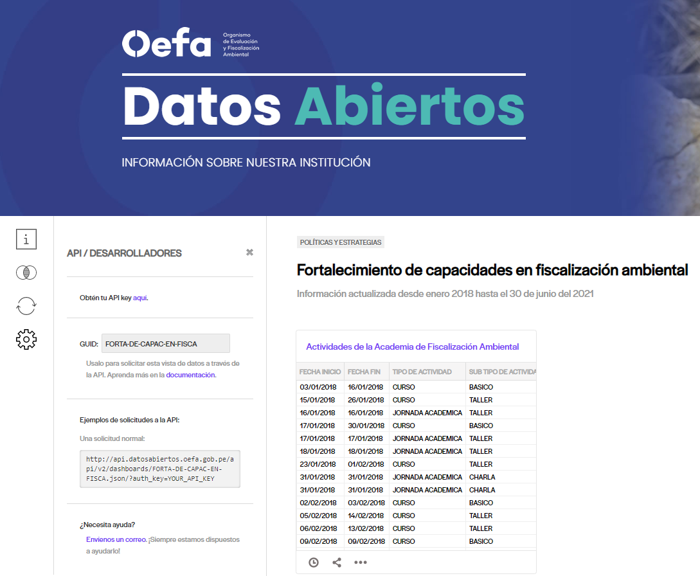
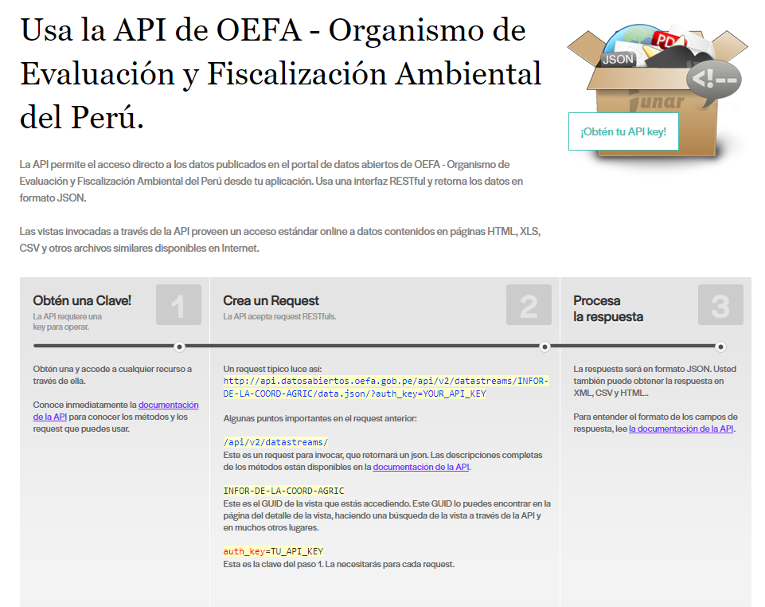
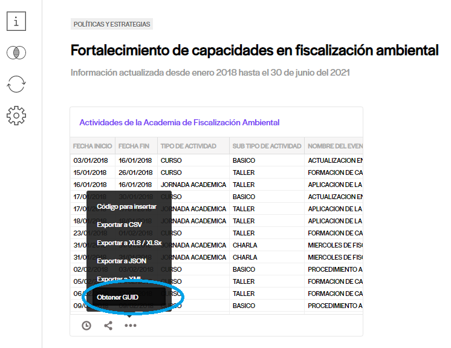
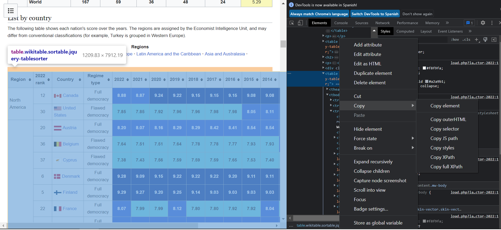
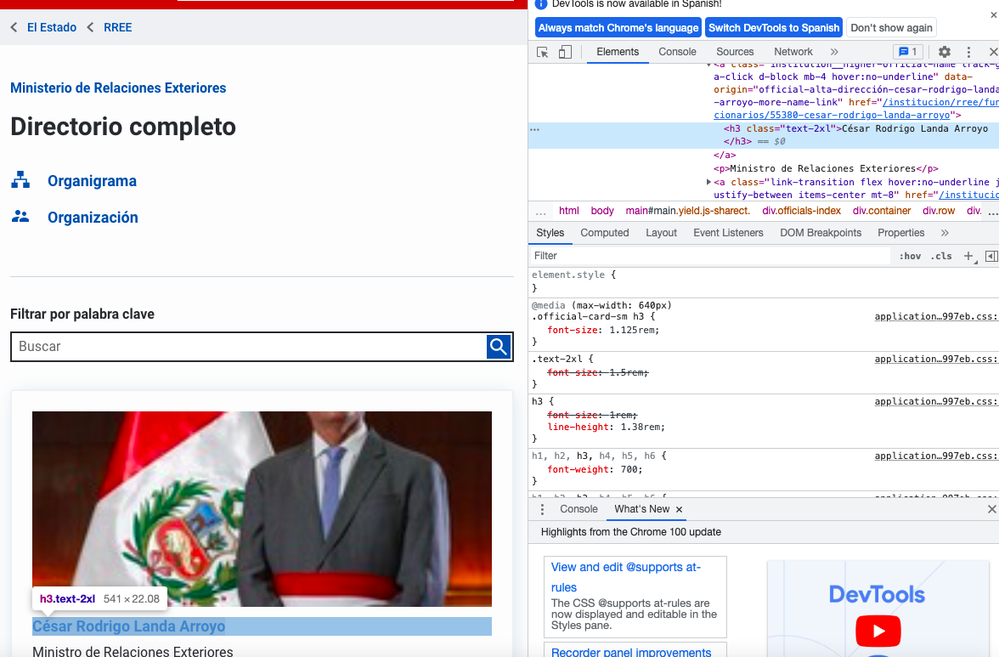

```{r,echo=FALSE, out.width="50%",fig.align="center"}
 
```

Hasta el momento hemos aprendido a importar datos estructurados desde nuestro ordenador, una web o paquetes de R. Hoy aprenderemos a importar datos desde servicios web que proporcionan información a través de "APIs" que son consultadas directamente por ordenadores. Asimismo, aprenderemos a extraer información no estructurada de manera programática de las páginas web usando las técnicas de "scraping".

# **1. Uso de las APIs**

*Video sobre qué son las APIs*: <https://www.youtube.com/watch?v=u2Ms34GE14U&t=105s>

API significa "Aplication Programming Interface" y se puede entender como un mecanismo que nos permite interactuar con un servidor de internet para acceder e intercambiar información. Una API cuenta con un interfaz para interactuar con el sistema sin necesidad de saber qué está detrás, y permite que se comuniquen aplicaciones o programas de software y compartan datos entre ellos, bajo ciertos estándares.

Las APIs facilitan mucho la recopilación de datos al poderse acceder a ellas de forma programática ya que proveen de un proceso de acceso a ellos estandarizado: se envía una "http request" a la API y se reciben los datos en un determinado formato, generalmente en JSON o XML. 

Vamos a ver en este curso, cómo obtener datos de una API REST en formato JSON (no es la única, pero son unas de las formas más usadas). Para este fin vamos a poner algunos ejemplos de API, sin embargo, usted debe tomar en cuenta que cada API en particular tiene una guia de uso y documentación que tiene que ser tomada en cuenta según sea el caso.

## Uso de API de OEFA

Vamos a hacer un ejemplo, extrayendo datos del portal "Datos Abiertos" del Organismo de Evaluación y Fiscalización Ambiental (OEFA). La OEFA es un organismo público, técnico especializado, adscrito al Ministerio del Ambiente de Perú encargado de la fiscalización ambiental en todo el territorio peruano.

Entremos al siguiente link y exploremos el portal brevemente: <https://datosabiertos.oefa.gob.pe/home>

En la categoría "Políticas y Estrategias en fiscalización ambiental", podemos encontrar data administrativa sobre las políticas e instrumentos de política pública ejecutados por la OEFA.

Vamos a explorar el componente de **"fortalecimiento de capacidades en fiscalización ambiental"**: <https://datosabiertos.oefa.gob.pe/dashboards/20548/fortalecimiento-de-capacidades-en-fiscalizacion-ambiental/> Damos click a la rueda de ajustes y leemos la información.



Si le das click a "Obtén tu API key aquí", te dirigirá a una web que indica cómo hacer uso del API: <https://datosabiertos.oefa.gob.pe/developers/>



Vamos a ejecutar estos pasos en R.

-   Lo primero que te sugiere el API es que obtengas tu llave (API_KEY). Consigue dando click donde indica, y guardala como objeto.

```{r}
miLLAVE="Tb8cWCER3JfE3DzbFcesiriPnTwURPuuz7NWmvNU"
```

-   Luego, te indica que construyas una solicitud (request) para colectar los datos. según lo que nos dice la página, la estructura del request está conformada por:

**El link del api de la página + el request para invocar que retornará en json + el GUID + el formato + mi clave (la que guardamos en el paso anterior).**

**NOTA: El link lo obtenemos de la siguiente manera:**



Procedemos entonces a crear nuestro request. Vamos a crear el link en objetos en función de los componentes mencionados anteriormente. Esto es solo para fines didácticos, en el futuro ustedes pueden armar un link completo en sus notas y utilizarlo como request.

```{r}
link="http://api.datosabiertos.oefa.gob.pe"
RQJSON="/api/v2/datastreams/"
GUID="ACTIV-AFA-36113"
FORMATO="/data.json/" 
KEY="?auth_key="
```

Entonces, tu solicitud se arma así:

```{r}
request=paste0(link,RQJSON,GUID,FORMATO,KEY,miLLAVE) # La función paste0 la usamos para concatenar todos los elementos sin separador
request #mirala
```

-   Finalmente, procesamos nuestra respuesta.

R necesita que instales jsonlite para poder interpretar formato JSON; luego de hacerlo, habilítala.De aquí, ya podrías colectar la data:

```{r}
library(jsonlite) 
OEFA = fromJSON(request) 
str(OEFA)
```

Si visualizas el objeto creado, verás que este pedido no se parece a lo que necesitas, ya que la estructura nos indica una serie de listas.

Para corregir esto, la documentación de API (<https://junar.github.io/docs/es/>), nos dice que podemos pedir otro formato para la vista de datos, el "PJSON":

```{r}
FORMATO='/data.pjson/'
request2=paste0(link,RQJSON,GUID,FORMATO,KEY,miLLAVE)
request2
```

Usemos la nueva solicitud:

```{r}
OEFA = fromJSON(request2)
```

Veamos su estructura:

```{r}
str(OEFA)
```

Para acceder a los datos en formato tabla de esa solicitud debemos acceder al elemento result y convertirlo en data frame:

```{r}
dataOEFA=data.frame(OEFA$result)
head(dataOEFA)
```

Con esta ruta vamos a poder obtener los datos en tiempo real, de las posibles actualizaciones que la OEFA haga sobre sus capacitaciones en fiscalización ambiental! Hasta el momento, tenemos datos hasta el DICIEMBRE DE 2022. Intentemos en un futuro a ver qué pasa!!!

# **2. 'Scraping'**

*Video sobre qué es el scrapping*: "What is Web Scraping and What is it Used For?" <https://www.youtube.com/watch?v=Ct8Gxo8StBU>

Ahora aprendamos a bajar información programáticamente de las páginas web usando las técnicas de "scraping".

En la vida real, no siempre nos darán las bases de datos listas para trabajar con ella,en muchos casos debemos descargarlas de páginas web y debemos limpiar y ordenar nuestra bbdd.

## Opción 1

Vamos a ver como extraer tablas que están en una web, es decir no son archivos colgados, sino tablas que han sido dibujadas por el programador.

Las tablas de datos en la web pueden ser descargadas con facilidad, si se consigue identificar la ruta hacia ella. Cuando identifiques una tabla que te interesa, usa el botón derecho de tu mouse para inspeccionar el código de la página web. Usa la opción inspección hasta que resalte toda la tabla.

Vamos a extraer la tabla de los resultados del "Democracy Index" por país, de la siguiente dirección: <https://en.wikipedia.org/wiki/Democracy_Index>

Estando en esa página usando **GoogleChrome** ubícate en la tabla e inspecciona usando el boton derecho, y copia el fullxpath



Para extraer esta table y convertirla en data frame, usamos el siguiente código:

```{r}
library(rvest)
url = read_html("https://en.wikipedia.org/wiki/Democracy_Index")
table = html_nodes(url, xpath='/html/body/div[2]/div/div[3]/main/div[3]/div[3]/div[1]/table[5]')
table = html_table (table)
table =data.frame(table)
```

## Opción 2

Vamos a ver otra forma de "scrapear", utilizando el paquete "rvest" (instalenlo antes).
¿Qué pasa si los datos que quiero obtener no están en un formato de tabla? Es decir no han sido programados en la página web de esa forma.

Veamos este caso: <https://www.congreso.gob.pe/?K=113>

Aquí encontramos una tabla. Bueno, al menos podemos visualizarla así, sin embargo, si inspeccionamos los códigos de la web, no vamos a encontrar un "path" como en el ejemplo anterior con el cual podamos scrapear esta tabla. Esto se debe a la forma en la que está diseñada la web.

Más aún, qué pasaría si quisiéramos extraer datos de una página web como esta: <https://www.congreso.gob.pe/?K=113>

Para estas ocasiones, **rvest** nos sirve.

+ Primero, abrimos la libreria y creamos un objeto con el link de la página web. Asimismo, obtenemos el código html de la web, con la función "read_html". Esto lo ponemos dentro de un objeto.

```{r}
library(rvest)
url="https://www.gob.pe/institucion/rree/funcionarios"
pagina_web=read_html(url)
```

+ Para scrapear vamos a requerir obtener la clase CSS de los campos que necesitamos. En términos sencillos, la clase CSS es un código que identifica a uno o varios elementos HTML. En esta página web, "Nombre" y "Cargo" han sido programados con una clase CSS para cada una.

Esta clase CSS la podemos obtener de la siguiente manera. Comencemos por Nombre

+ Hacemos click derecho sobre el renglón de un país y seleccionamos inspeccionar:

+ Luego, automaticamente en la parte derecha se nos abrirán los códigos resaltando el que pertenece a ese espacio, colocamos nuestro mouse por encima de esa linea resaltada del código y se nos aparecerá la clase CSS. Ese código lo escribimos copiamos.

```{r,echo=FALSE, out.width="100%",fig.align="center"}
 
```

Con ese código, continuamos de la siguiente manera:

```{r}
css_nombre="h3.text-2xl" # contenemos la clase CSS en un objeto
nombre_html <- html_nodes(pagina_web,css_nombre) # con html_nodes y html_text, obtenemos el código html que contiene los nombres
nombre_texto <- html_text(nombre_html) 
head(nombre_texto) #vemos los datos
```

Hacemos lo mismo para la otra columna "cargo"

```{r}
css_cargo="p"
cargo_html <- html_nodes(pagina_web,css_cargo)
cargo_texto <- html_text(cargo_html)
head(cargo_texto)
```
Finalmente, armamos la base de datos

```{r}
dataWS3 <- data.frame(NOMBRE = nombre_texto, CARGO = cargo_texto)
head(dataWS3)
```

Hagamos otro ejemplo:

```{r}
url="https://www.congreso.gob.pe/?K=113"
pagina_web=read_html(url)
```

```{r}
css_nombre="a.conginfo" # contenemos la clase CSS en un objeto
nombre_html <- html_nodes(pagina_web,css_nombre) # con html_nodes y html_text, obtenemos el código html que contiene los países
nombre_texto <- html_text(nombre_html) 
head(nombre_texto) #vemos los datos
```

```{r}
css_grupo="span.partidolist"
grupo_html <- html_nodes(pagina_web,css_grupo)
grupo_texto <- html_text(grupo_html)
head(grupo_texto)
```

```{r}
dataWS4 <- data.frame(NOMBRE = nombre_texto, GRUPO = grupo_texto)
head(dataWS4)
```

Uno más complejo: la página de funcionarios/as del MEF

<https://www.gob.pe/institucion/mef/funcionarios>

```{r}
url="https://www.gob.pe/institucion/mef/funcionarios"
pagina_web=read_html(url)


css_nombre="h3.text-2xl" 
nombre_html <- html_nodes(pagina_web,css_nombre)
nombre_texto <- html_text(nombre_html) 

css_cargo="p"
cargo_html <- html_nodes(pagina_web,css_cargo)
cargo_texto <- html_text(cargo_html)

dataWS5 <- data.frame(NOMBRE = nombre_texto, CARGO = cargo_texto)
head(dataWS5)
```

Pero nos faltan funcionarios/as. Solo estamos jalando la primera página de tres. ¿Qué hacemos aquí?

Para esto vamos a aprender a utilizar funciones e iteraciones, que nos permita descargar las páginas de manera sistemática. 

Una función es un conjunto de instrucciones que convierten las entradas (inputs) en resultados (outputs) deseados. Las iteraciones (loops) son de gran utilidad cuando necesitamos hacer la misma tarea con multiples entradas; repetir la misma operación en diferentes columnas o en diferentes conjuntos de datos.

Creamos los objetos necesarios:

```{r}
url="https://www.gob.pe/institucion/mef/funcionarios?sheet="
css_cargo="p"
css_name="h3.text-2xl"
final_table = list() # list es una función para crear listas
```

Construimos la función e iteración

```{r}
library(dplyr)
for(i in 1:3) { # INPUT
  webpage <- read_html(paste0(url, i)) #obtenemos el código html de las 3 páginas
  cargo_texto <- webpage %>%
    html_nodes(css_cargo) %>% # obtener el código html del css del cargo
    html_text() # lo convertimos en un vector de texto
  name_texto <- webpage %>%
    html_nodes(css_name) %>% # obtener el código html del css del name
    html_text() # lo convertimos en un vector de texto

final_table[[i]] <- data.frame(NOMBRE=name_texto, CARGO=cargo_texto) # OUTPUT: Con esto estamos creando una lista con 3 data frames que contenga las 3 páginas scrapeadas
}
```

Ahora convertimos todo en una base de datos

```{r}
dataWS6 = bind_rows(final_table)
head(dataWS6)
```

