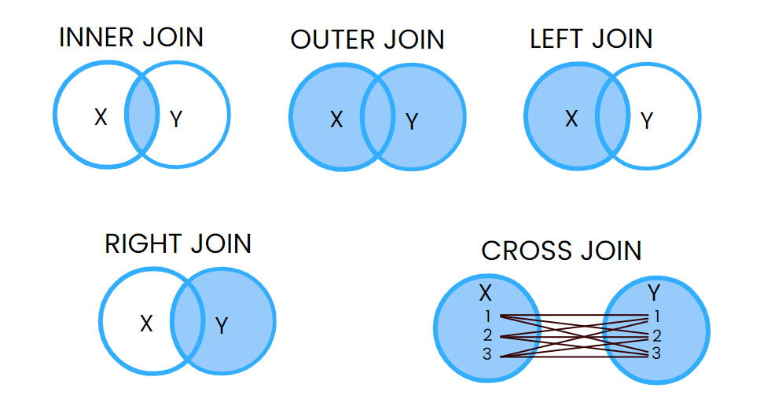
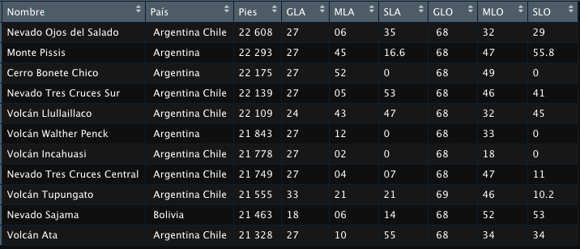

# Merge

Este proceso combina data frames con difente información, siempre que tengan un campo común (key), y este no se repita en ninguna otra columna.

```{r}
library(rio)
data="https://github.com/PoliticayGobiernoPUCP/estadistica_anapol2/raw/master/DATA/corruption.csv"
corru=import(data)

data2="https://github.com/PoliticayGobiernoPUCP/estadistica_anapol2/raw/master/DATA/demo.csv"
demo=import(data2)
```

Estos dos data frames deben tener un campo (columa) en común que sirva de "key":

```{r}
names(corru)
names(demo)
```

El merge producirá una tabla integrando las columnas que correspondan a cada key. Vea que la columna rank está presente en las tres pero no es la key; como el ranking se puede calcular si se necesitase, eliminemoslos de cada data frame:

```{r}
# eliminando
corru$Rank=NULL
demo$Rank=NULL

#La columna Score de la tabla democ podriamos cambiar para no olvidar qué representa:

colnames(demo)[2]='ScoreDemo'

#Hay una column Region en las dos bases, quedémonos con la de democracia:
corru$Region=NULL
```

```{r,echo=FALSE, out.width="80%",fig.align="center"}
 
```
Con estas bases de datos, vamos a explorar los escenarios de merge que podemos aplicar.
Ten en cuenta que el método principal de la función merge es para data frames. Sin embargo, merge es una función genérica que también se puede usar con otros objetos (como vectores o matrices), pero serán transformados a la clase data.frame

### Inner join

Un inner join (en realidad un natural join), es la unión de conjuntos de datos más habitual que se puede realizar. Consiste en fusionar dos data frames en uno que contenga los elementos comunes de ambos. Para fusionar o unir los dos conjuntos de datos de muestra, solo tienes que pasarlos a la función merge, sin la necesidad de cambiar otros argumentos, debido a que, de manera predeterminada, la función combina los conjuntos de datos por los nombres de las columnas comunes.

```{r}
corrgdp=merge(corru,demo)
str(corrgdp)
```

El resultado es un data frame que contiene las observaciones que están presentes en ambos data frames, las que no, no están presentes en la salida resultante.

### Outer join 

El outer join, o unión completa, combina todas las columnas de ambos conjuntos de datos en uno para todos los elemento. Para crear el full outer join de dos data frames en R tienes que establecer el argumento all como TRUE.

```{r}
corrgdp2=merge(corru,demo,all=TRUE)
str(corrgdp2)
```

Ahora tenemos un data frame con todos los casos. Como no todas las filas en el primer data frame coinciden con todas las filas en el segundo, en la salida aparecen valores NA en esos casos.

### Left join

El left join en R consiste en unir todas las filas del primer data frame con los valores correspondientes del segundo.Para crear la unión, tienes que establecer all.x = TRUE.

```{r}
corrgdp3=merge(corru,demo,all.x = TRUE)
str(corrgdp3)
```

Ahora tenemos un data frame con todos los casos de la primera base de datos (177 casos). Si esta contiene observaciones que no están en la segunda base de datos, tendra NA como valores en las variables que correspondan.

### Right join

El right join en R es lo opuesto al left outer join. En este caso, la combinación consiste en unir todas las filas del segundo data frame con las correspondientes en el primero.En consecuencia, necesitarás establecer el argumento all.y como TRUE para unir los data frames de esta manera.

```{r}
corrgdp4=merge(corru,demo,all.y = TRUE)
str(corrgdp4)
```

Ahora tenemos un data frame con todos los casos de la segunda base de datos (228 casos). Si esta contiene observaciones que no están en la segunda base de datos, tendra NA como valores en las variables que correspondan.

### Cross join

El cross join o unión cruzada, realiza el producto cartesiano de los conjuntos de datos.
Puedes crear un cross join en R estableciendo como NULL el argumento by de la función merge. 

```{r}
corrgdp5=merge(corru,demo,by=NULL)
str(corrgdp5)
```

Estas operaciones también las podemos hacer con Dplyr, la cual hemos utilizado anteriormente.

```{r}
library(dplyr)
data_resultado1=left_join(corru,demo,by="Country") #left_join Prioriza las filas de la primera base de datos
head(data_resultado1)
data_resultado2=right_join(corru,demo,by="Country") #right_join Prioriza las filas de la segunda base de datos.
head(data_resultado2)
data_resultado3=inner_join(corru,demo,by="Country") #inner_join Prioriza las filas que COINCIDEN en ambas fillas base de
head(data_resultado3)
data_resultado4=full_join(corru,demo,by="Country") #full_join PPrioriza las filas que están en ambas fillas base de datos
head(data_resultado4)
```


EJERCICIO 2:

Extraiga la tabla de los volcanes más altos del planeta del siguiente link: <https://es.wikipedia.org/wiki/Anexo:Volcanes_más_altos_de_la_Tierra> 

Le solicitan crear un código de limpieza para ordenar esa base de datos, sobre la cual se irán añadiendo casos en el futuro. El objetivo es utilizar la técnica de limpieza de su preferencia para separar los pies de altura, grados, minutos y segundos de cada una de las coordenadas de cada volcán. Luego de ello, eliminar las variables innecesarias y quedarse con una data limpia. La base debe verse así:

```{r,echo=FALSE, out.width="80%",fig.align="center"}
 
```


